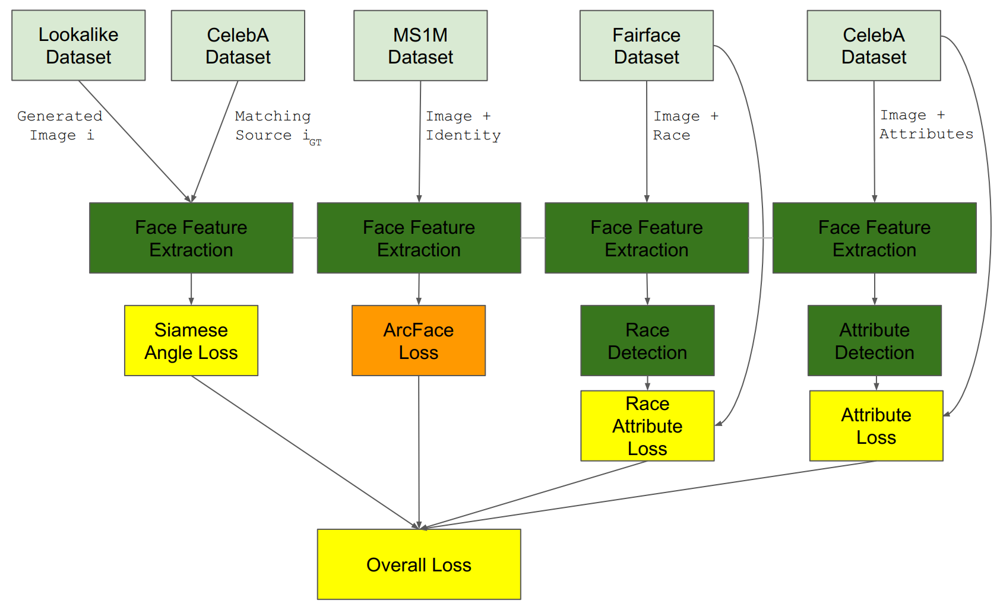
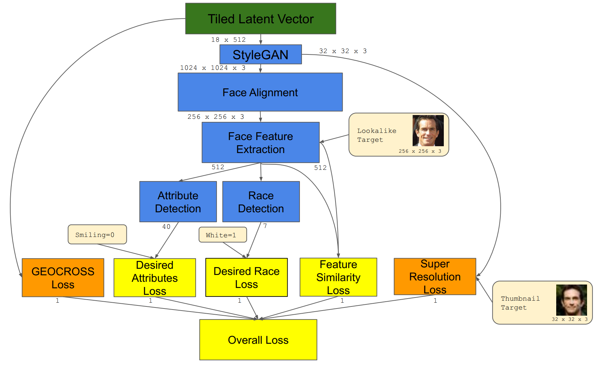
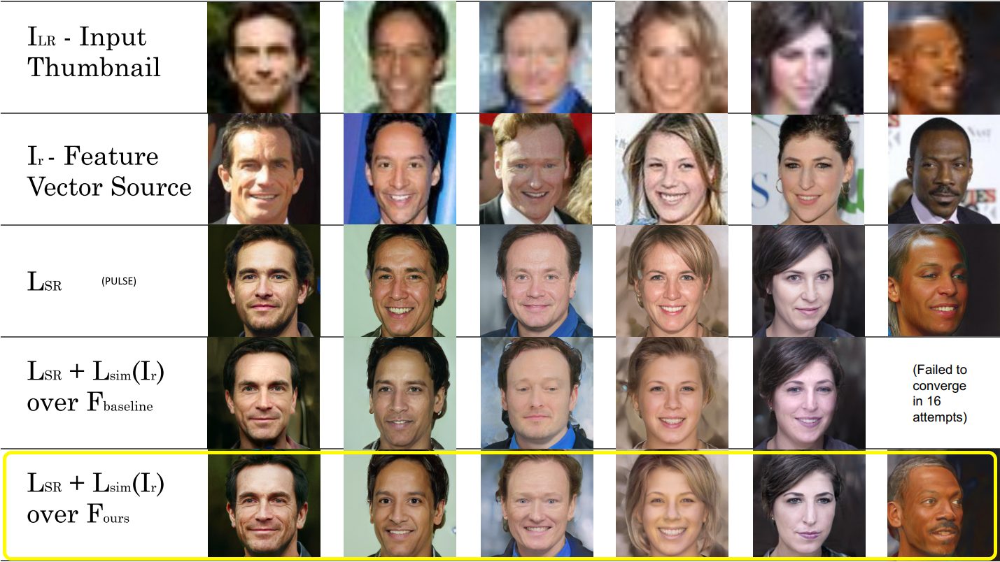
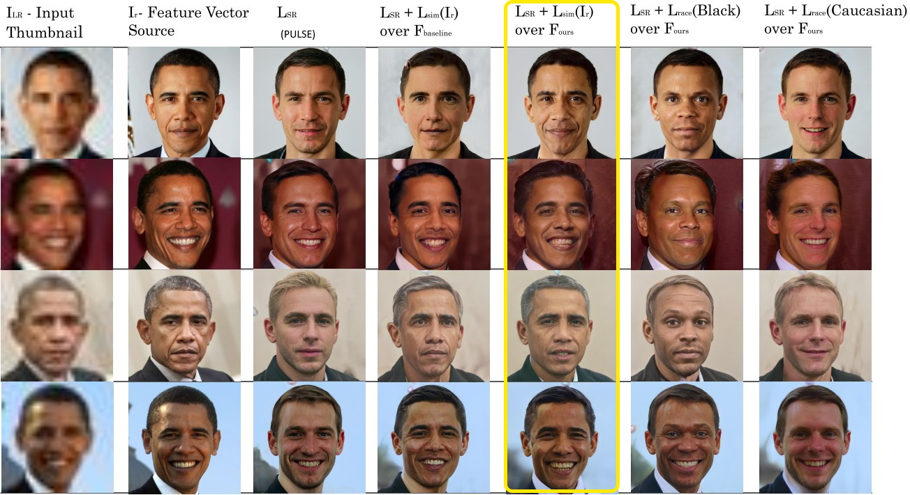
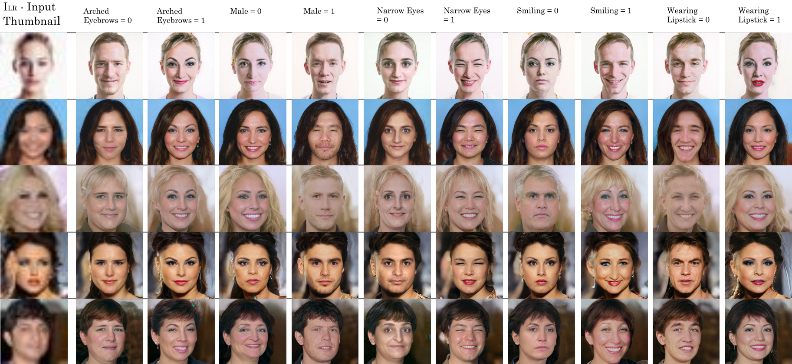

# Identity and Attribute Preserving Thumbnail Upscaling
Accompanying Code for the Accepted ICIP 2021 Paper [IDENTITY AND ATTRIBUTE PRESERVING THUMBNAIL UPSCALING](https://arxiv.org/abs/2105.14609) by Noam Gat, Sagie Benaim and  Lior Wolf.

## Abstract
We consider the task of upscaling a low resolution thumbnail image of a person, to a higher resolution image, which preserves the person's identity and other attributes. Since the thumbnail image is of low resolution, many higher resolution versions exist. Previous approaches produce solutions where the person's identity is not preserved, or biased solutions, such as predominantly Caucasian faces. We address the existing ambiguity by first augmenting the feature extractor to better capture facial identity, facial attributes (such as smiling or not) and race, and second, use this feature extractor to generate high-resolution images which are identity preserving as well as conditioned on race and facial attributes. Our results indicate an improvement in face similarity recognition and lookalike generation as well as in the ability to generate higher resolution images which preserve an input thumbnail identity and whose race and attributes are maintained. 

## Architecture

### Face Feature Extraction
We build upon the face feature extraction architecture of [ArcFace](https://arxiv.org/abs/1801.07698), and add additional training losses to explicitly preserve identity, race and facial attributes:

Note that the feature extraction network is the same one with the same weights for all tasks. 

### Face Generation
We then use this augmented feature extractor to generate faces with a technique similar to [PULSE](https://arxiv.org/abs/2003.03808), with additional user-provided goals to control the identity of the generated faces:
 

## Results

### Similar Identity

### Implicit and Explicit Ethnic Target

### Explicit Attribute Target

## Running Instructions
You must have a working model in order to run. 
The full argument list can be found in run.py. 
For a ready to run example, see `run_obama.sh`. 
There is currently a hard-coded hack in place in `loss.py:72`, if you use `ATTR_X_IS_0/1` loss for faces, leave the code unchanged. For attributes, comment out lines 72-74.

## Training instructions

### MS1M Dataset
1. Download ms1m-retinaface-t1.zip from https://github.com/deepinsight/insightface/wiki/Dataset-Zoo , place in InsightFace_v2/data 
2. run `InsightFace_v2/extract.py`
3. Install conda environment from `preprocess.yml`
4. run `python pre_process.py` from InsightFace_v2 directory
### Fairface Dataset
5. Download Fairface Database with 0.25 Padding from https://github.com/joojs/fairface and place in fairface directory of root directory
6. Run `python fairface_dataset.py` from InsightFace_v2 directory
### CelebA Dataset 
7. Run `python download_celeba.py` from root directory
8. Run `python align_face.py CelebA_Raw CelebA_Large 256`
9. Run `python align_face.py CelebA_Raw CelebA_Small 32` 
### Adversarial Dataset
Coming soon

### Train the face feature extactor
10. Run `python train.py` from InsightFace_v2 directory. You may have to adjust batch_size parameter based on GPU memory. This will train the model with just the Arcface loss.
11. Run `python train.py --adverserial --fairface --attr --checkpoint <step10result> --checkpoint_suffix _full` from InsightFace_v2 directory.
### Create a configurator file based on your trained model
12. There are two sample configs in `configs/arcface_best.yml` / `configs/arcface_latest.yml` which use the result of 11 by default 

## Pretrained model
Coming soon